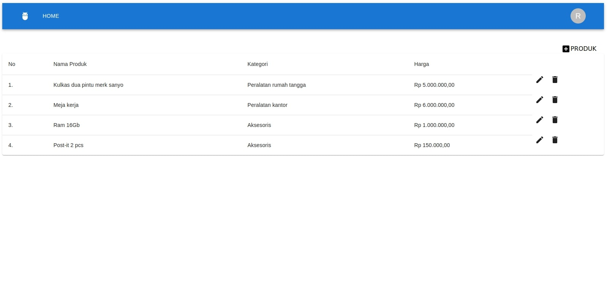

 

# Product App Fullstack

## Teknologi yang digunakan

- react + vite
- express
- redux toolkit
- react router dom
- mongodb
- axios
- material ui
- tailwind
- toastify

---

## Cara menjalankan aplikasi

Clone aplikasi ke lokal mesin anda dengan perintah git clone https://github.com/franskbarek/product-app-fullstack.git

### Backend :

Masuk ke dalam direktori aplikasi dengan perintah **`cd product-app-fullstack/server`**

Install node modules yang terdapat pada **`package.json`** sebelum menjalankan aplikasi

Install dependensi dengan perintah **`npm install`** atau **`yarn`** jika menggunakan yarn

Jalankan aplikasi backend dengan perintah **`npm run start-dev`** atau **`yarn start-dev`** jika menggunakan yarn

API akan berjalan pada http://localhost:5000 dan siap digunakan.

### Frontend :

Masuk ke dalam direktori aplikasi dengan perintah **`cd product-app-fullstack/client`**

Install node modules yang terdapat pada **`package.json`** sebelum menjalankan aplikasi

Install dependensi dengan perintah **`npm install`** atau **`yarn`** jika menggunakan yarn

Jalankan aplikasi backend dengan perintah **`npm run dev`** atau **`yarn dev`** jika menggunakan yarn

User Interface Aplikasi akan berjalan pada http://localhost:5173 dan siap digunakan

(<a href="#readme-top">back to top</a>)

